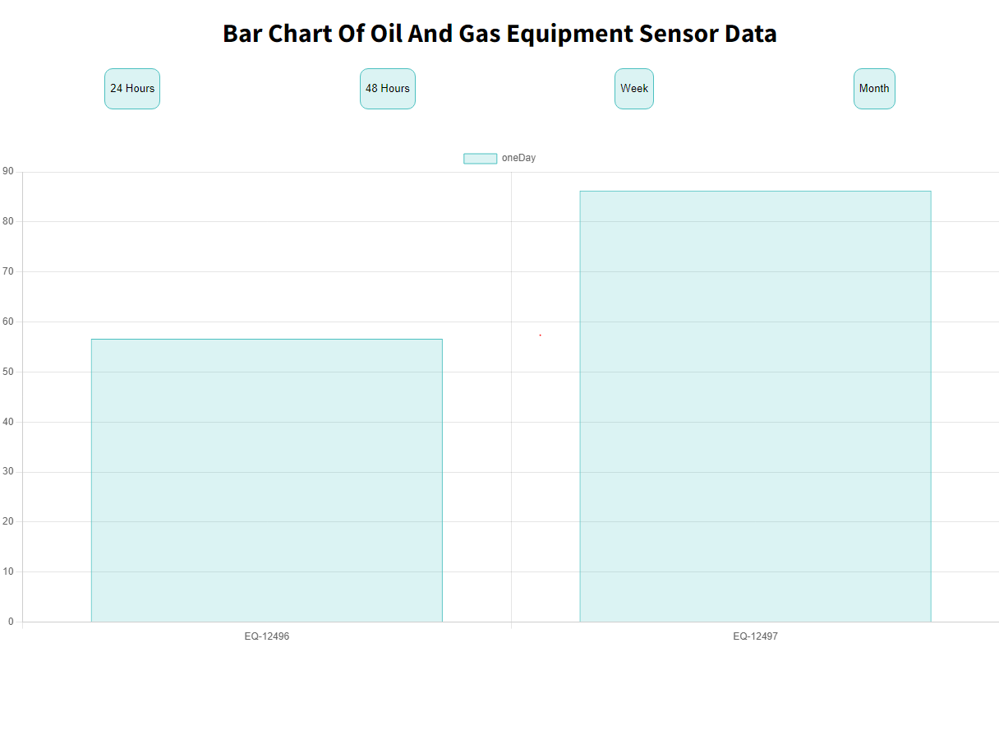

```markdown
# Sensor Data Monitoring System

## Description

This project is a sensor data monitoring system designed to collect, store, and visualize sensor data in an oil and gas plant. The solution consists of a React frontend, a Node.js backend with Prisma, and a MySQL database. The system includes charts on the frontend to visualize the collected data and provides endpoints for managing sensor data.


## Technologies Used

- **Frontend**: React, react-toastify
- **Backend**: Node.js, Express, Prisma
- **Database**: MySQL
- **Data Visualization**: Charts using React charting libraries (e.g., Chart.js)

## Features

1. **Real-Time Data Reception**
   - The backend has a `/sensorData` route that receives sensor data in JSON format and stores it in the database.

2. **Recovery of Missing Data**
   - The `/sensorRecoveredData` route allows uploading CSV files containing sensor data that was not captured in real-time, filling gaps in the database.

3. **Data Visualization**
   - The React frontend displays charts showing sensor values over different periods (last 24 hours, 48 hours, 1 week, 1 month), facilitating data analysis and monitoring.

## Project Structure

- Backend - Clean Architecture

## Setup and Installation

### Requirements

- Node.js
- MySQL
- npm or yarn

### Steps

1. **Clone the Repository**
   ```bash
   git clone <repository-url>
   cd project-root
   ```

2. **Backend Setup**
   - Navigate to the `backend` folder and install the dependencies:
     ```bash
     cd backend
     npm install
     ```
   - Configure the environment variables in the `.env` file with your MySQL database information.
   - Run the Prisma migrations to set up the database:
     ```bash
     npx prisma migrate dev
     ```

3. **Frontend Setup**
   - Navigate to the `frontend` folder and install the dependencies:
     ```bash
     cd frontend
     npm install
     ```
   - Start the development server:
     ```bash
     npm start
     ```

4. **Start the Backend**
   - In the `backend` directory, start the server:
     ```bash
     npm run dev
     ```

## API Routes

### `/sensorData`
- **POST**: Receives sensor data in JSON format and stores it in the database.

### `/sensorRecoveredData`
- **POST**: Receives a CSV file to fill gaps in the sensor data.

### `/sensorData`
- **GET**: Returns sensor data for the frontend to display.

## Additional Resources

- The repository includes an exported Insomnia file with pre-configured routes.
- A CSV example file for testing is provided.
- A database dump is available—important to run this dump before starting to use the project.
- An external link to view the system improvement proposal diagram is available: [System Improvement Diagram](<https://drive.google.com/file/d/11Tf6K3NHv1sHTmE_-8s6T7gJ8edyfJFR/view?usp=drive_link>).

## Contact

For any inquiries, you can reach out to:

- [LinkedIn](https://www.linkedin.com/in/ruan-ribeiro/)
- Email: [ruan.software.engineering@gmail.com](mailto:ruan.software.engineering@gmail.com)

## License

This project is licensed under the MIT License. See the LICENSE file for more details.

## Backend Dependencies

- **@prisma/client (v3.8.1)**: The Prisma Client is an auto-generated and type-safe query builder for Node.js & TypeScript that connects to your database.
- **express (v4.17.1)**: A minimal and flexible Node.js web application framework that provides a robust set of features to develop web and mobile applications.
- **joi (v17.4.0)**: A powerful schema description language and data validator for JavaScript.
- **module-alias (v2.2.2)**: A module to create aliases of directories and register custom module paths, making the importing of modules easier.
- **multer (v1.4.5-lts.1)**: A middleware for handling multipart/form-data, which is primarily used for uploading files.
- **validator (v13.6.0)**: A library of string validators and sanitizers.
- **xml2js (v0.6.2)**: A simple XML to JavaScript object converter.

### Some Backend DevDependencies

- **@types/express (v4.17.13)**: TypeScript definitions for Express.
- **@types/jest (v26.0.22)**: TypeScript definitions for Jest.
- **@types/module-alias (v2.0.1)**: TypeScript definitions for module-alias.
- **@types/multer (v1.4.11)**: TypeScript definitions for Multer.
- **@types/node (v14.14.41)**: TypeScript definitions for Node.js.
- **@types/supertest (v2.0.11)**: TypeScript definitions for supertest.
- **@types/validator (v13.1.3)**: TypeScript definitions for validator.
- **@types/xml2js (v0.4.14)**: TypeScript definitions for xml2js.
- **dotenv-cli (v4.0.0)**: A CLI tool to load environment variables from a `.env` file.
- **git-commit-msg-linter (v3.1.0)**: A tool to enforce commit message conventions.
- **husky (v4.3.6)**: A tool to prevent bad `git commit`, `git push`, and more.
- **jest (v26.6.3)**: A JavaScript testing framework.
- **jest-mock-extended (v2.0.4)**: An extension for mocking in Jest.
- **prisma (v3.8.1)**: The Prisma CLI tool.
- **sucrase (v3.18.1)**: A super-fast TypeScript transpiler.
- **supertest (v6.1.6)**: A superagent driven library for testing HTTP servers.
- **ts-jest (v26.5.5)**: A TypeScript preprocessor for Jest.
- **ts-node (v9.1.1)**: TypeScript execution and REPL for Node.js.
- **ts-node-dev (v1.1.6)**: A TypeScript Node.js execution with auto-reloading.
- **typescript (v4.2.4)**: TypeScript language support.

## Some Frontend Dependencies

- **@testing-library/jest-dom (v5.17.0)**: Custom jest matchers for testing DOM elements.
- **@testing-library/react (v13.4.0)**: Utilities for testing React components.
- **@testing-library/user-event (v13.5.0)**: Simulates user events for testing.
- **@types/jest (v27.5.2)**: TypeScript definitions for Jest.
- **@types/node (v16.18.104)**: TypeScript definitions for Node.js.
- **@types/react (v18.3.3)**: TypeScript definitions for React.
- **@types/react-dom (v18.3.0)**: TypeScript definitions for React DOM.
- **axios (v1.7.2)**: A promise-based HTTP client for the browser and Node.js.
- **chart.js (v4.4.3)**: A JavaScript library for creating charts.
- **react (v18.3.1)**: A JavaScript library for building user interfaces.
- **react-chartjs-2 (v5.2.0)**: React components for Chart.js.
- **react-dom (v18.3.1)**: React DOM library.
- **react-scripts (v5.0.1)**: Scripts and configuration used by Create React App.
- **react-toastify (v10.0.5)**: A library for toasts and notifications.
- **styled-components (v6.1.12)**: A library for styled components in React.
- **typescript (v4.9.5)**: TypeScript language support.
- **web-vitals (v2.1.4)**: A library for measuring web vitals (performance metrics).
```

